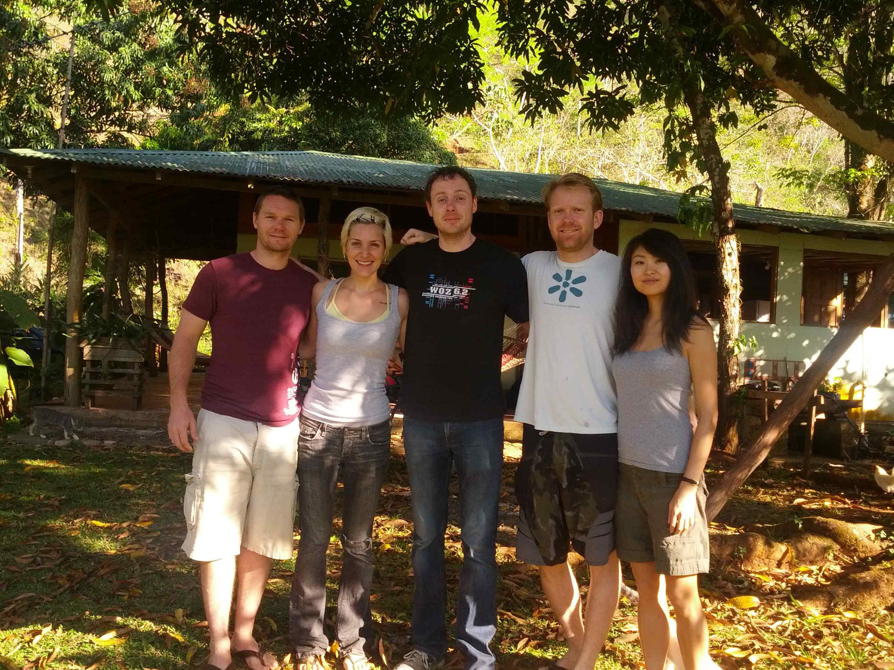

# Conscious Companies Advance
*March 29-31, 2013*

*La Choza del Mundo, Alto Concepcion, Costa Rica*

-----------

# Welcome and Intros

Discussion of personal backgrounds, motivations and interests. 

# What do we mean by Conscious Companies

+ purpose of an intentional company is to benefit/have a net positive impact for all "stakeholders" (as opposed to just shareholders)
+ but in the limit are the stakeholders just the entire world?
+ natural capitalism (book/movement) highlighted the difference between stakeholder and shareholder
+ axes of "positive impact" - profit, sustaiability, morality, experience of
working there, 
+ is there a single definition of purpose? assuming not, then a definition of
conscious/intentional company should be a way that people can manifest their
own statement of purpose in their companies. 
+ relationship between organizations and educations systems - gaviotas became a multigenerational community 
+ are there more general attributes of a conscious company? 
	+ caring for stakeholders (wait, that actually emcompasses everything!)
+ thus need to be more clear on net positive, on timeframe, 
+ and as a business, need to be clear about who your stakeholders are. your
primary stakeholders (one or more categories) will determine your focus for
purpose/intention. 
+ what is a company? mission, governance, economic model (who benefits from proceeds). also has rights and a persistence over time as an entity. 
+ IF you attribute purpose to this creation, with no mechanism for evolution of that purpose, you have a bit of a 'frankenstein' model, a monster that cannot be stopped. but at the same time want the ability to encode purpose such that it cannot be undone by those with different intent. 
+ if a corporation was a person they'd be a psychopath
+ idea of a kamikaze clause - a logic around how long/when the org should survive, or when it should not. 
+ a different way to think about giving birth to a company with purpose is something like Asimov's 3 laws.
+ what can we do so that corporations are nice people?
	+ maybe less tied to purpose? 
	+ this notion of being a nice person is orthogonal to the specific purpose. 
	+ need an intention/purpose. 
+ **the idea of each company being part of a network of companies goes to accountablity within a group of people (companies) you trust.**
	+ the network can be thought of as a class of stakeholder?
	+ the idea is not to constrain what IS a meaningful purpose - people
should define their own purpose. and separate to that, we think there might be
"nice qualities" of companes, that exist independent of the mission/purpose
(and yet, might also set boundary conditions for what constitutes "good"
intentions.)
	+ eg. natural step method requires you to NOT have a negative environmental
impact. but this is hard to do, and also hard to measure. 
	+ there can be many networks, each of which commit to one or more metrics of accountability/transparency. 
	+ companies could participate in one or more networks. networks could issue some kind of 'badges' to participating companies. 
	+ the badges notion is nice because it gives flexibility to meet certain criteria within a larger option pool. 
+ what's the operating system under which purposive companies run?
	+ identify and then make it easy for people to adopt this model
+ proposal for breakdown of this definition:
	+ mission (intentional companies need to clearly articulate their mission
	+ governance methods (who participates, what categories of decision maker, etc.)
	+ governance principles (eg. transparency, virality)
	+ economics and finance (how the company elects to make money)
	+ lifecycle/longevity
+ we live in a somewhat special time that is unusually open to new systems -
because technologically we can build them, and because intellectually we have
more experience with more systems and are starting to question the simplistic
dogma. 
+ consider that it USED to be that anyone with a lot of money was expected to do something "good" with it. 
+ a mentality today is that people have a "right" to create a corporation without any social mission - but perhaps people are ready for a different expectation, a different language, to emerge. 
+ change the conversation, and change the notion of the american dream - to create something that has a huge social impact. 
+ we should also balance our language when talking about the "right" to make
capital, especially for people who haven't come from a background of financial
privilege, versus creating a pressure for people to do something "more"
important. 

Ideas for qualities of a company that would make them likable:

+ process for reflecting on how your actions impact your stakeholders
+ process for (and posture of) feedback loops and learning
	+ but here we assume that a learning organization WILL actually learn - not necessarily the case.  
+ how do you set up an organization that can change/evolve, in a way where the PROCESS of change is ITSELF moderated?
	+ this is the role we see the network playing - eg. instead of delaware approving your company, the network YOU have decided yourself to align with, would approve you. 
+ "dead should not govern the living" - you could also institute a
sunset/kamikaze clause IN THE NETWORK level
itself. which might address the concern about institutionalization of company
creation (cf. research questions). 
	+ cf. articles of confederation - constitution creates a structure for
PROCESS. ie, what are the ok ways to make laws - do you need a simple majority,
et.c
	+ notion of sunset clause - what if every company was instead organized around a deliverable, and when you deliver that product the organization goes away automatically?
	+ maybe it's not that companies HAVE to be finite or infinite in time - but that there should be INTENTIONALITY around duration. 
		+ so need a governance model that identifies as the outset how long you want to exist for. 
	+ the meta-governance network might be defined by the people that join it, and people in that network are where companies in the network get their employees from. 
	+ there might be something magic about a given team - a team with great chemistry can identify and work together again. 
	+ hollywood actually works like this!
	+ **the meta-networks could be kind of like "guilds" of people with shared
values?**
	+ are guilds relevant or orthogonal - the idea of a team of people with similar skills you can learn from is one approach; but the idea of people who make a good team is often about a good MIX of people - so not always people who share your skills. 
	+ If we do guilds, how do you make membership work?
+ fair/open/transparent conflict resolution mechanism
+ external accountability of some kind
+ good listener
+ transparency
+ accountability
+ pride
+ happiness
+ supportive 
+ decision making driven from longevity/big picture (of the broader society)
+ ability to admit you are wrong
+ true engagement (i have worth as a stakeholder, i have a voice?)
+ the willingness to (and a demonstrated history of) choosing these values over growth
+ alignment of incentives?
+ honesty

more on intentional companies:

+ will there always be conflicts between your stakeholders? and as such, there
must be a mechanism for conflict resolution. 
+ commons-based and open-source based organizations - interesting example
because if you leave or get fired, your identity is not lost because it was
entirely wrapped up in the organization. 
+ a corporation was an invention. a GREAT invention - but one that was just AN
invention in the space of possible inventions. it could be time for something
NEW, too. 
+ both inspiration and frustration with governance models
+ open source elevates mediocrity? people who have most time get the most
influence. it is not a panacea. 

## More on the Network of Networks, or the Meta-Network

+ Infrastructure for intentionality, and a set of non-negotiables
+ qr code instead of or in addition to a brand logo/badge?
	+ follow the qr code to go straight to the data about this 'badge'
+ natural language descriptions instead of numerical ratings? but still well-structured data (natural language fields). 
+ enable an ecosystem
+ pull or fork model - goal is to truly make it easy for anyone to create or join an accountability network
	+ need to think though how to make this info useable for consumers.
+ possibly have a baseline sunset clause for each individual badge of xx years; people can tweak the duration of a badge, but the duration of that badge is something that the participants have to sign on for. 
+ the meta network is more focused on setting the baseline structure for badges and hosting the data. 
+ meta-network eats its own dogfood, uses the same process
+ each network would have its own encoding
+ open to participation by anyone according to an openly documented protocol
+ the encoding process *does* entrench a fixed value, but the check and balance on the system is that anyone can fork that network or create their own network
	+ also the idea of sunset clauses for networks.
+ better to be small and specific than too diverse, as companies can be part of many networks.
+ can we create incentive for intentional companies to exist, by making it valuable for them to do so?
+ the meta-network might be a good *tactical* approach, but how do you incentivize these values beyond just "teaching to the test." ie, end up focusing on meeting the requirements instead of truly internalizing/incentivizing it. 

# Ideas about corporate structures 

+ what are some radically different notions of corporate structures
	+ legal and decision making, stakeholders, partnerships, etc. 
+ GPL-style corporation - any money that goes into that company stays in that company or its offshoots - sort of a 'viral' approach to what a company produces. 
	+ like a non-profit but with a different meme attached to it
+ defining other notions of return 
	- eg. the embassy network: if you give money you receive this implicit (or explicit but non-financial) benefit of accommodations. 
+ an 'open money' approach - you receive currency that is only valuable within a certain ecosystem
+ not for *personal* profit 
	+ company can make a profit and employees can take salaries but shareholders never take a dividend and all profits go back into the broader community/projects/other companies. 
	+ less restricted than a non-profit in terms of what can be done with the profits, salaries, etc. 
	+ otherwise relatively similar. 
+ there are structures you can use already, but what's interesting is the meme we attach to it, or the specific things you put in, say, the articles of incorporation. 
+ there is a difference between structures and design patterns
	+ structure is more formal, but often design patterns have lots to do with charismatic leaders. 
+ open franchise model 
	+ openly documented process and tools for running a company such that it is openly and/or freely replicable. 
	+ based on the notion that market success should come from service and performance rather than privileged access to information. 
+ weighted membership model
	+ decision making influence (and possible profit share in the case the
	organization has such things), are a weighted function of your
	participation in the organization, by some metric and unit
	as defined by the organization. 

## Existing Structures and Organizational Approaches

Companies that have implemented very interesting managerial processes or legal structures:

+ mozilla (structurally)
+ kodak
- Greenfield
+ valve (flatness)
+ netflix (management)
+ p2pu (openness, 'open source' in its decision-making)
+ many more... part of our research is to document these. 

## Analysis of Corporate Form
Book report on "The Ownership of Enterprise," by Harry Hansmann

- nice analysis of benefit and control
- 4 classes of ownership of companies, defined by the patrons of the firm:
	- Supplier-owned
	- Customer-owned
	- Employee-owned
	- Investor-owned
- case studies of businesses in different industries, where are types of companies most successful?
- biggest indicator of success is whether cost of decision-making is low
- when stakeholders have a bunch of different opinions, cost of decision making is so high that it's very difficult to be successful. 
- eg. law firms as partnerships are basically employee-owned, as most everyone does the same work. 
- homogeneity of interests makes cost of decision making low
- "Success" for Hansmann is defined as market dominance
	- comment: but efficiency != benefit or success!
	- the book makes the point more that these are the business that are dominant in the marketplace - not a commentary on whether this is good or bad. 
- Matching four kinds of ownership
- Employee ownership: Works best when there's only one class of employee
	- Cost of decision-making has to be low to be successful (Law firms work well)
	- Age diversity has problems (older workers are more risk averse than younger workers, etc)
	- Lumber firms work well, because everyone does all the jobs
	- Homogeneity of interest
- ESOPs (employee stock ownerhip plans): Fairly big government subsidy, gives employees benefit but not control
- Co-Determination (German): Control but not benefit - employees have seats on the board, but don't get financial benefits
- Electricity: Mostly consumer-owned (in rural), rarely consumer owned in urban
- Marketing Coop, like Oceanspray (cranberries) or Land O'Lakes (dairy): Supplier Owned
- comment: supervotes are an example of control separated from financial benefit 
- comment: a new potential category of control would be algorithmic - prediction markets, crowdsourcing, etc. 
	- though in this case we have outsourced the data collection but not necessarily control?

### Existing Legal Forms

Types of legal entities:

- FPC
	- creates a new safe harbour in addition to business judgement, requires boards and maagement to consider environmental and social factors in addition to shareholder value in both the ordinary course of business and change of control situations. 
	- you define your own social and environmental goals
	- you are *required*, as opposed to allowed, to consider these social and environmental factors. 
- Benefit corporation
	- may, but not required to, consider factors besides shareholder dollar value. 
- low-profit LLC (L3C)
	- mostly designed as a hack for IRS rules to make it easier for foundations
to make program-related investments in technically for-profit but
mission-driven companies (often with a "primarily" charitable purpose). 
	- still has same issues with capital market acceptance as LLCs. 
- regular LLC
	- pass through
	- liability protection
	- no stock
	- each partner must sign on to the operating agreement, so makes growth slow.
	- have total flexibility to do what you want between partners of an LLC. 
- C corps, S corps
	- basically opposite of LLCs
- hybrids (non-profit owns for-profit, vice-versa, or linked through agreements)
	- more overhead on legal and operational levels
	- clear separation of responsibility/concerns
	- eg. mozilla
- Cooperatives
	- worker-owned
	- employee owned
	- membership based 
	- ESOPs
- Trusts
	- GRATS, REITs, etc. 
- Societies and countries?

Internal structures - mechanisms of structuring control, decision making, oversight, profit-distribution, etc. Existing and new ideas:

- issuing non-voting shares
- supervotes
- advisory boards
- voting trusts (idea)
	- set up a separate entity that you give some percentage of your supervote shares to
	- delegation of decision-making without giving away ownership (dollar value)
- board seats
- franchises
- give options to purchase to an external trusted entity (idea)
- foundation owning IP, licensed back to for-profit 
- kamikaze clauses (idea - has anyone implemented this?)
- customer advisory board - giving your stakeholders a voice
- frequent opportunities for insight and feedback - higher frequency leads to more substance, involvement, relationships and trust.
- fair use policy attached to advisory board?
- motivate your advisors: 
	- public recognition
	- power and influence
	- association with an awesome network
	- stock / financial reward
- boards are useless, board members are priceless(?)
- provide a coordinator to the advisory board
- they own the mission and the evaluation of the mission(?)
- duration of seat on that board?
- Intentional signal and representation
- Jury decision making: mix of experts and general populace (idea)
  - Burden of service as part of career track (ala Google Staff Engineer)
- Inclusion: Privilege and Burden of Governance

## Internal Governance/Management: Ideas

- Conflict Resolution
- Task Assignment
- Career Mentorship
- Leadership (fostering team cohesion)
- Coupling of authority and responsibility
- can we come up with a different term from "management" that is more celebratory? leadership? 
- when zappos hires, they make every single person spend the first month in
customer service. 
- rotating leadership/roles
	- Go through lots of roles (start as a dishwasher)
	- should not just be so that managers have greater compassion for those "under" them, but also to open up the spectrum of possibilities for people at all levels. 
	- perhaps rotation can be either mentorship, or exposure, but in a way that doesn't harm the company. 
	- rotational and other styles of management could be one form of the badge/meta-network. 
- team cohesion:
	- Mutually shared understanding of the goal
	- Mutual respect and regard for each individual's contribution to that goal
- Management is a skill that most should become basically proficient at (like writing english). But it's not a required logical career endpoint.
	- Russell Ackoff: f-Laws
- DUNBAR's NUMBER: 150
	- Shared experience
	- Diversity of engagement
- investment in company culture: 
	- Institutional Knowledge is valuable.
- retraining or cross-training slows things down. and that's okay.

## Design Patterns
ie, "in general, and all else being equal, x leads to y."

- openness of information leads to employee/stakeholder empowerment
- flat structures tend to be limited by dunbar's number
- less structure requires greater transparency

Would like to do more on this!

### Examples: companies with interesting design patterns

- valve
- netflix
- kodak
- gore

### Specific design pattern idea
- parties most at risk of being exploited financially should be in control (or "Who can get screwed the most should own it")
	- Employees in position of exploitation, 
	- suppliers in case of limited access to market (dairy)
	- consumers (Tru-value) but not fast food (because it doesn't create consistency)
- diversity of opinion raises decision-making cost
	- so make it worth it? diversity must raise value as well?
	- using technology, eg. predictive markets, algorithmic crowdsourcing, etc. can change how this work. 
	- maybe a different way to put it is that the more diverse the
participants, the poorer an approximation the organization is able be to be to
those diverse interests. 
- if decision making is a calculus... (josh idea)

# A High Level Statement of Intent, Non-Negotiables

Exploring possible language:

- Net Positive without negative to any class of stakeholder
- "it is possible and valuable goal for the improvement of societies to be zero-net positive across all externalities." 
- "the purpose of companies should be to produce value that lead to net positive effect." 
- "do no evil and then do some good." 
- you should believe that your company can do some good without exploiting anything/anyone. 
- your company should be able to make mistakes, but should learn from them
- should be a self-aware learning organization. 
- (there is a narrative of progress that we should be careful about). 
- fear of failure should not stop you from trying. 
- forgiveness and compassion
- don't want people to sweep things under the rug when they go wrong
- reward failures that are well-documented and learned from 
- don't make mistakes over again
- a declaration of being a learning company, an intentional company where we value learning from failures. 

# Financing
Different approaches to financing, financing of experimental organizations

- Kickstarter for equity
- Family and Friends funding
- SBA loans
- Foundation grants / SRI
- JOBS ACT / Crowdfunding for equity (lots of startups lined up for this, like http://wefunder.org)
- DPO: Direct Public Offering
- Don't call it Capital.
- It's easier to give things away before it's worth anything.
- Personal wealth pledge or 1% of nothing is an early binding step.
- It's worth considering that you can give or "pledge proceeds" to a network
- Consider using alternative currencies to keep proceeds tied to a particular purpose or set of values.
- There's a possibility for a pay-it-forward, no investor proceeds model.
- Forms of Investment:
	- Debt
	- Equity
	- Pension
	- Insurance
	- Alternative Currency

# Additional topics for Future Discussion
Touched upon in other sessions but worth having future sessions on:

- Lifespan
- Human Capital
- Externalities
- Labels/naming/language
- Relationship of your business to its externalities
 

# Research Topics Identified [researchtopics]
+ what is already out there? (FPC, Natural Step program, benefit corporations,
  values-based business network (regional in BC), low-profit LLC), eg. conscious capital, sharing economy tie-in, various similarly-themed conferencs, etc. 
+ how can we use/hack our language to increase the impact we want to have with
our ideas?
+ new terms we can use (and the context they conjure up)
+ How do these ideas apply to any group of people (families, communities). 
+ looking at the example of institutionalization of science and how it has homogenized scientific pursuits, and the possible analogies to creating networks in which you participate as a business. 
+ how/to what extent can you invest in other businesses as a non-profit 
+ what are examples of companies that have made innovative use of advisory
boards  to set direction or make decisions?
+ have any companies adopted kamikaze/sunset clauses?
+ general study and analysis of design patterns
+ The guilds idea
+ The meta-network idea

# References

+ “The Ownership of Enterprise,” by Harry Hansmann (mid 1990s)
+ the e-myth revisited: nice clear discussion of franchising. emphasis on designing your company as if you are making a handbook for other people. 
+ the myth of shareholder value
+ karl fogel's producing open source software (also: kickstarter-funded new
version being written 2013). 
+ the cathedral and the bazaar. 
+ gaviotas, the book
+ open money - ecosystem for creating currencies.
+ Van city credit union

# Summary Session: Key themes and Ideas

- "Zero net positive": aka, Companies as nice people.
	- What qualities would that have?
	- What does it mean to be intentional?
	- Learning organization: it's okay to make mistakes. Fail and learn.

- Stakeholders vs. Shareholders: 
	- Companies have relationships with all stakeholders.

- Meta-network / networks
	- Network membership represents a commitment to pursue and/or uphold:
	- Transparency of a set of memberships
	- Possibly exceeding minimum thresholds for those metrics
	- Badges would be the communication of these metrics or achievements or commitments
	- Meta-network allows easy creation of networks
	- Allows pull request and forking of networks
	- Networks can also represent a commitment to an organization's lifecycle or natural review period
	- RISKS: Networks might not be the right structure, it could produce groupthink ala academic institutions
	- THINK ABOUT: Can networks play the role of advisory boards or connect to them?

- Easy and Legible communication of purpose
- Things in the commons are "local public good"
- Governance should be organized with thoughtful consideration of the balance between the cost of decision making, and the disenfranchising effect of a diverse group of unrepresented stakeholders.
- Governance should be considered in the context of a separation between Profiteur and Controller.
- Discussion of stakeholders should be aware of the tension between the reductionist effect of categorization, and the expense of treating each unique element separately.
- COMPANIES SHOULD BE BENEVOLENT in their relationships with their stakeholders.
- GOOD COMPANIES COME FROM GOOD PEOPLE.
- THE DEAD SHOULD NOT GOVERN THE LIVING. (Revisit or sunset company charters periodically).
- Thoughtful companies can (should?) invest in the development of their employees as humans.
- HUMAN CAPITAL:
	- Pensions or Insurance can relate to how life needs change over time.
	- Employees can have two types of leaders or managers: mentors and managers.

## Ideas for Names

- Intentional Organizations?
- Conscious Organizations
	- network.io?
- Non-Violent Organizations?
- the "New Norm"? ("New Norm Organizations"?)
- Dynamic Organizations?
- **Thoughtful organizations/companies** (best so far)
- Learning Organizations

## Moving Forward

+ A statement that is succint, that has language we're on board with, that we can propagate with intention to bring in more people to the research agenda. 
	+ attract other people 
	+ choose what our story is - what words do we want to use to communicate this
	idea? what story do we tell to others? how do we want to hack the language we use with ourselves and others?
	- clarify How is this different? Why do we care. 
- Clarify Non-negotiables.
- Settle on Name 
- Decide what grammar we want to use - cf. the [Glossary section][glossary]

- **RESEARCH / LEARNING RESOURCE:**
    - hosted on github
	+ forkable examples of corporate "sourcecode" (articles, resolutions, etc.); wiki for docs and research, google docs as needed for non-github users.
		+ not just a collection of different examples, but examples with analysis (things that did and didn't work, why, etc.)
		- Lots of strawmen
	+ [research questions/agenda][researchtopics] to be pursued and documented within this resource
		- Guilds (Research)
			- Could have historical parallels to unions, trade guilds
			- Social responsibility for a collection of individuals
			- Could be attached to professional development, mentoring
			- Could be attached to pensions / insurance
			- Can also be attached to value declarations ala network membership
		- 'Meta-networks' concept
	- Pluses and minuses for different types of financing
	- clarify a 'taxonomy'
	- Example articles of incorporation, board resolutions, etc. 
		- forkable structures
		- 'make; make install' for companies 
		- creative commons style: asnwer a few simple questions, auto-generate articles, structures, processes as a starting point. 
	+ "handbooks" for people who want to create their own conscious companies. 
	- Collection of Design patterns and observed management structures

Additional Ideas:

+ year-long salon series on this topic (robbie @ the embassy in SF)
+ bookclub (cholmes will invite)
+ look at conferences we could attend
- Call a tax lawyer to understand implications of different funding and structure ideas. 
+ personal pensions/endowments
+ wealth pledge

## Next Steps

+ Jessy: 
	+ report/notes
+ Cholmes: 
	+ summary/statement
	+ set up github organization
	+ commits to working on this 30 hours/month
+ Joshua: 
	+ domain name
	+ mailing list
	+ brainstorm list of potential collaborators to widen the circle
+ Robbie:
	+ ~monthly salon on intentional companies to advance (not repeat) the conversation. 

# Glossary [glossary]
Terms we would like to redefine/rebrand/rename

- **profiteur**: someone who profits financially from the organization
- **controller**: someone who has influence/exercises control over the organization
- raising **capital**: need a different word for this
- **capitalism**: new word. 
- **management**: a word that is more celebratory?

